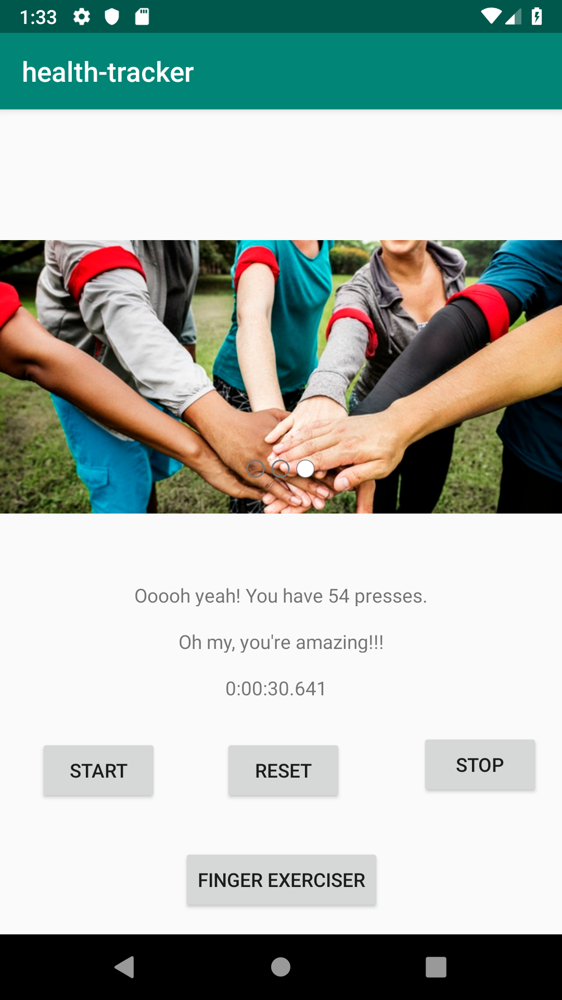
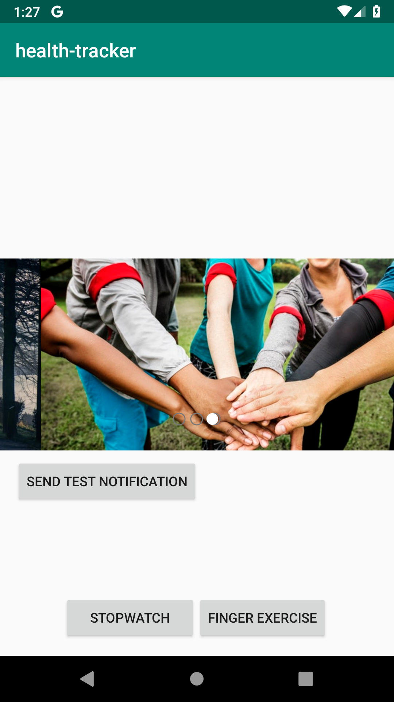
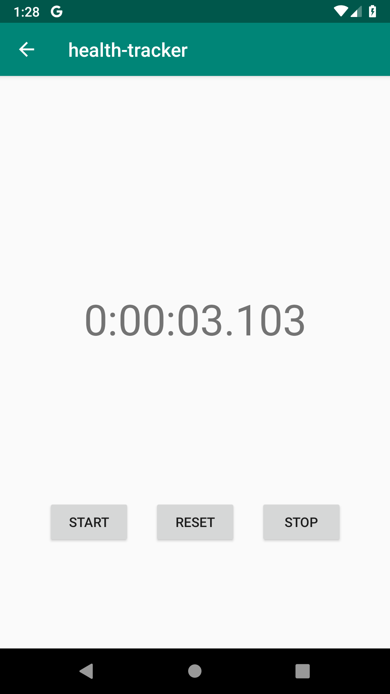
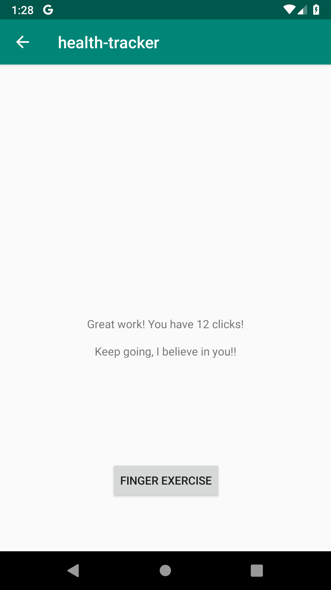
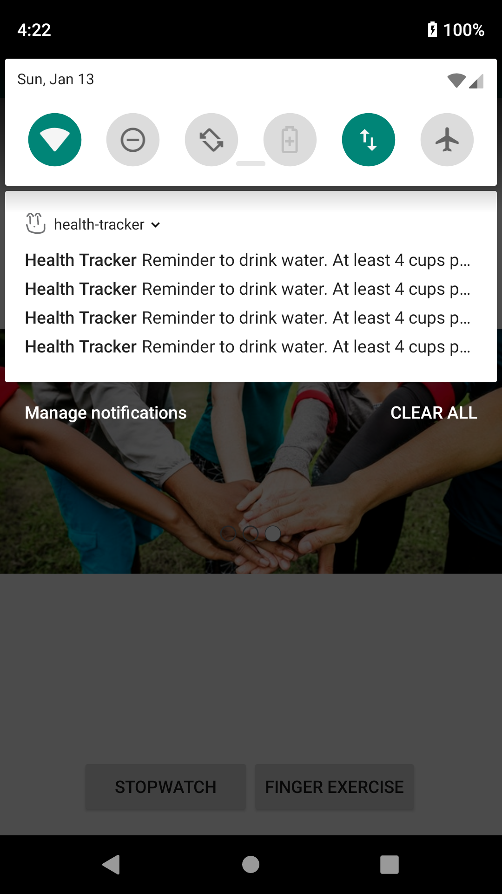
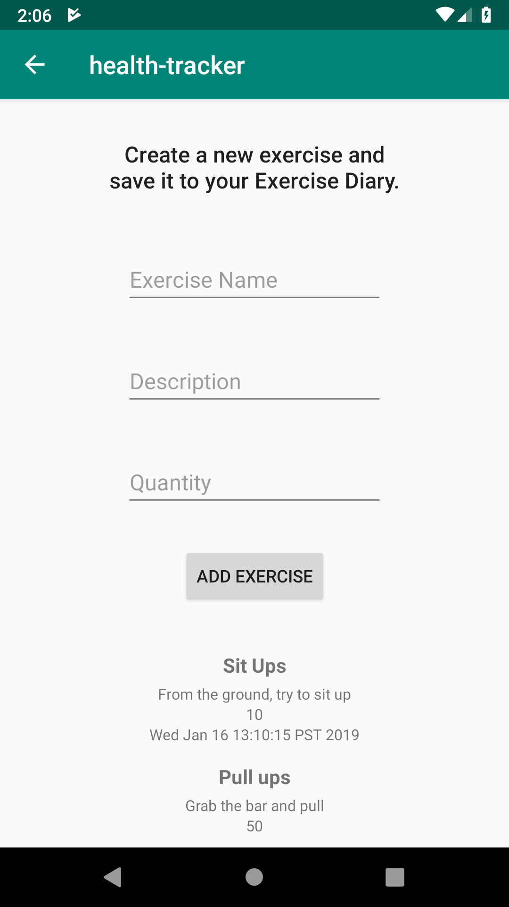

# Health Tracker

The Health Tracker is the first Android app that I am developing.  It emulates a Health app by focusing on things like exercise, but mainly it is a platform to learn how to develop an Android app.

## Lab 26 Features

* Added a button that can be tapped and a counter will display how many taps the user has made.  Encouraging messages will be displayed as the count get higher.
* A stopwatch was added to the main view, with start, stop, and reset buttons.  The stopwatch starts at 0:00:00.000 and goes up to 0:00:00.000.
* Image carousel was added which display different exercise-themed images.

### Screenshot

## Lab 27 Features
* Separated the Stopwatch and Finger Exercises onto different pages.
* Added a "Water Reminder" notification to be sent ever two hours on button click.
* Added buttons to the main activity to access the pages.
* Added a back button to return to the main activity from Stopwatch and Finger Exercises.
* Styled pages, added multiple buttons to a LinearLayout.
* Moved strings to the strings.xml file.

### Screenshots

  
   
  
  

## Lab 28 Features
* Added Android Room Database.
* Adding new Exercise Diary entries to the database.
* Displaying Exercise Diary Entries with RecyclerView.

### Screenshots

  

## Lab 29 Features
* Added testing using Espresso.
* Testing: Main Activity, Stopwatch, Finger Exercise, and Exercise Diary.

## Lab 33

* Created a backend using a Java Spring App that contains an Exercise database.
* Backend deployed to Heroku, and has POST and GET routes at: https://healthtrackerbackend.herokuapp.com/exercise
* Backend on GitHub: https://github.com/jeffborda/health-tracker-backend
* Android app now displaying the deployed database and the local database with GET route.
* Android app now making POST requests to deployed database from the "Add Exercise" form.

## Credits

* Image carousel sourced from: https://github.com/sayyam/carouselview
* Video on TimerTask used to help develop the stopwatch: https://www.youtube.com/watch?v=36jbBSQd3eU
* More information about TimerTask utilized from: https://www.tutorialspoint.com/java/util/timer_scheduleatfixedrate.htm
* Setting up Alarm Manager: https://gist.github.com/BrandonSmith/6679223
* Setting up RecyclerView: http://www.vogella.com/tutorials/AndroidRecyclerView/article.html
* Setting up POST Request with Android Volley: http://www.itsalif.info/content/android-volley-tutorial-http-get-post-put
* Parsing Gson into a list: https://stackoverflow.com/questions/8371274/how-to-parse-json-array-with-gson/8371455
* Testing buttons with Espresso: https://stackoverflow.com/questions/32906881/checking-if-a-button-is-clickable-in-espresso-test-android-studio
