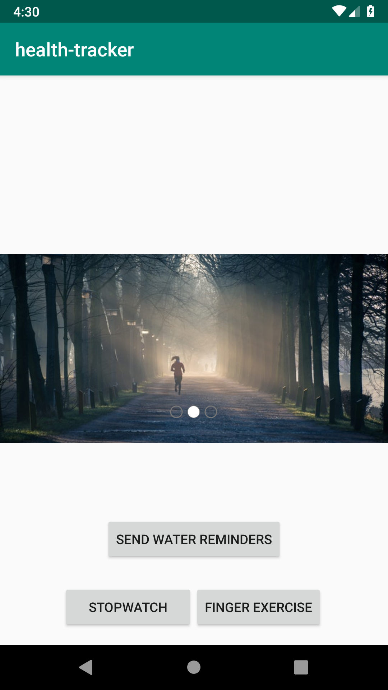

# Health Tracker

The Health Tracker is the first Android app that I am developing.  It emulates a Health app by focusing on things like exercise, but mainly it is a platform to learn how to develop an Android app.

## Lab 26 Features

* Added a button that can be tapped and a counter will display how many taps the user has made.  Encouraging messages will be displayed as the count get higher.
* A stopwatch was added to the main view, with start, stop, and reset buttons.  The stopwatch starts at 0:00:00.000 and goes up to 0:00:00.000.
* Image carousel was added which display different exercise-themed images.

### Screenshot

## Lab 27 Features
* Separated the Stopwatch and Finger Exercises onto different pages.
* Added buttons to the main activity to access the pages.
* Added a back button to return to the main activity from Stopwatch and Finger Exercises.
* Styled pages, added multiple buttons to a LinearLayout.
* Moved strings to the strings.xml file.
* Started code to send scheduled notifications (incomplete).

### Screenshots

     

     

## Credits

* Image carousel sourced from: https://github.com/sayyam/carouselview
* Video on TimerTask used to help develop the stopwatch: https://www.youtube.com/watch?v=36jbBSQd3eU
* More information about TimerTask utilized from: https://www.tutorialspoint.com/java/util/timer_scheduleatfixedrate.htm
